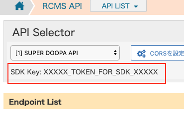

# KurocoSDK

> NodeJS library that generates Typescript or Javascript clients based on the OpenAPI specification for Kuroco.

If you are not familiar with Kuroco yet, please take a look here first : [kuroco.app](https://kuroco.app/)

Kuroco SDK project aims to generate a dynamic frontend sourcecode (henceforth referred to as kuroco lib) (currently in Typescript or Javascript) wrapping the API of your current Kuroco project as a convenient collection of methods, allowing an easy usage of your Kuroco API through data definition objects, removing parts of technical burden and more, thus facilitating the usage of the API to allow you to focus on the business logic of your frontend application.

Please note that the generated code is dynamically assembled using the current Kuroco configuration & API definition. Were this configuration to change (API definitions, topics groups configuration, etc), you are required to regenerate the SDK for it to adjust to your latest configuration.

### :heart: Acknowledgments

This project is powered by an adaptation of [openapi-typescript-codegen](https://github.com/ferdikoomen/openapi-typescript-codegen), many thanks to the author [Ferdi Koomen](https://github.com/ferdikoomen) for his work !

---

## Installation

-   Install globally :  
    `npm i -g kuroco-sdk && kuroco -V`

-   Or install locally in your current project:  
    `npm install -D kuroco-sdk && npx kuroco -V`

### Pre-requisities

**Node 12.13.1 or higher**  
http://nodejs.org/

### Configuration

First step is to configure the project.
We recommend to do so by running `kuroco init`, which will walk you through an interactive prompt to create the configuration file.
Alternatively, it can be done by manually by adding `kuroco.config.json` file in your project's root folder.

The file will contain a JSON configuration object like below :
```
{
    "sdk_key": "c9cdfd46b60bb0a34ba5c2c153ffad3f",  // Kuroco authorization token for the SDK
    "api_url": "https://demo.picol.app"             // Your Kuroco API host URL
    ... // other configurations
}
```

#### :question: Where can I get my SDK key ?

The `sdk_key` can be found on the API List page of your Kuroco management interface.


---

## Kuroco SDK quickstart

```
npx kuroco init && \
npx kuroco pull && \
npx kuroco generate
```

If you don't have Kuroco and just want to try codegeneration,  
Run the following command in this repository:  
```
npm i kuroco-sdk -D && npx kuroco generate -i node_modules/kuroco-sdk/example/openapi.json
```

---

## Features

### Initialization

`kuroco init` interactive prompt for easy configuration

### Pulling OpenApi definitions from Kuroco

`kuroco pull` can pull (download & write) the latest OpenApi definitions from Kuroco.

### Generating TS/JS kuroco library

`kuroco generate` builds the TypeScript/JavaScript kuroco lib based on the pulled OpenApi definition that you can integrate to your app to interface with Kuroco API
Language may be selected using `-l` (or `--language`) option (default being typescript).

```
kuroco generate -l javascript
```

> If your project is using Typescript and you want to generate kuroco lib outside of your project's src folder, you may declare your custom directory path using `typeRoots` property in `tsconfig.json` :
> `"typeRoots": ["./generated"],`

### Integrating the generated kuroco library to your application

The recommended way to import kuroco library is through ESModule :
```typescript
import { Auth, TopicsService } from "kuroco";

/** Fetch Topics data on login */
async function getTopicsList() {
  await Auth.login({
    requestBody: { email: 'test', password: 'qwer1234' },
  })
  return await TopicsService.getTopicsServiceRcmsApi1Topics1({});
}
```

There are 2 ways to generate and install kuroco lib :
1. run `kuroco generate --lib -o outputDir` and `install outputDir --save`,  
   import them with `import Kuroco from 'kuroco'` in your code.
2. run `kuroco generate -o in/your/src/outputDir`  
   and just import them with `import Kuroco from 'in/your/src/outputDir'` in your code.
The first variant will export its own `package.json` into the output directory, which can be used to bootstrap your application's npm project
The second variant exports the library as TypeScript or Javascript(commonjs) modules.

Alternatively, if your application is **NOT** an npm project (plain Javascript loaded by the browser), there is an option to generate the library as an executable js dependency bundled as `index.js`.
The option is `--standalone`, so in this case you can use `kuroco generate --language javascript --standalone`.  
After that, simply load the generated library using the basic way in your HTML header :
```html
<!DOCTYPE html>
<html lang="en">
  <head>
    <meta charset="UTF-8" />
    <script src="kuroco-standalone/index.js"></script>
  </head>

  <body>
        <script>
            const { Auth, TopicsService } = Kuroco;

            async function getTopicsList() {
                await Auth.login({
                    requestBody: { email: 'test', password: 'qwer1234' },
                })
                return await TopicsService.getTopicsServiceRcmsApi1Topics1({});
            }

            getTopicsList()
                .then(console.log);
        </script>
  </body>
</html>
```

You can checkout full list of options with `kuroco -h` or `kuroco generate -h`.  
For more examples, please check out [official code samples](https://github.com/diverta/kuroco_sdk_examples) supplied with Kuroco.

#### Authentication handling

Due to multiple authentication patterns supported by Kuroco - mainly that each Kuroco API can be configured to be based either on Authentication header token or cookies, and at the same time be public or private - there is a technical burden of properly calling Auth API. To handle the implementation details for you, we provide an `Auth` module that covers all authentication patterns, even if you have defined multiple APIs having different authentication patterns.

So, if you have properly setup Authentication APIs in your Kuroco management interface, we recommend using the generated `Auth` module instead of manually invoking authentication API

```typescript
import { Auth } from 'kuroco';
Auth.login({ requestBody: { email: 'test@example.com', password: 'PASSWORD' } })
    .then(...)
```

`Auth.login()` wraps the login logic depending on whether the API uses token (in which case it proceeds to chain login API -> token API calls to fetch your authentified token) or cookies (only login API is called in that case)
on the other hand executes only login if not.

##### Handling unauthorized requests and expired sessions (tokens)

You should create an error handler for unauthorized requests in order to implement custom processing when the token expires (redirect to login page for example). The default handler ignores these errors, which is not ideal for a real world application.

Please note that in case when your API uses tokens, and your token API has `use_refresh_token` setting set to true, Auth module is able to detect access token expiration error and automatically issue a request for a new token using the stored refresh token. However if refresh token is also expired, the retry call will be unauthorized as well - the handler is required anyways.

```typescript
import { Auth } from 'kuroco';
/**
 * Auth.onErrorHandler: (result: Result) => Result = result => result
 */
Auth.onErrorHandler = result => {
    this.router.goto('/login');
    return result;
};
```

#### File uploading

Kuroco may be connected to Firebase Storage to enable file uploading. This feature requires you to configure Firebase credentials & app on Kuroco management interface prior to generating kuroco library.

We provide an Uploader (`UploaderFactory`) component to facilitate file uploading.

Here is an example of how we use it in our component :
```typescript
import { UploaderFactory } from 'kuroco';
...
    onChangeInputFile(e: Event) {
        const newFile = (e.target as any).files[0] as File;
        this.uploader.upload(newFile)
            .then((res) => console.log(res.url))
            .catch(console.error);
    },
    async mountUploader() {
        try {
            this.uploader = await UploaderFactory.create({})
        } catch(e) {
            console.error('could not creat uploader for:', e);
        }
    }
```

> File uploading is only possible for authenticated and logged in users

#### Generating API information

We provide a way to optionnally generate additional (meta) information about endpoints. This may be useful, for example, for e2e testing.

```
kuroco generate -exportApiInformations
```

```typescript
const AuthenticationalGetResponseExamples = [];
ApiInfos.filter(info => info.className === 'AuthenticationService')
    .filter(info => info.httpMethod === 'get')
    .forEach(async info => {
        const res = await info.method({ requestBody: {} } as any);
        AuthenticationalGetResponseExamples.push(res);
    });
```

#### Using FirebaseApp

The KurocoSDK includes the FirebaseSDK.  
You can use Firebase application instance as needed.  
Here is an example of using thier analytics feature in an our implementation:

 ```typescript
 // main.ts

 /** apply analytics */
import 'firebase/analytics';
import { firebaseApp } from 'kuroco'; // instance of firebase already initialized.
try {
  firebaseApp.analytics();
} catch (e) {
  console.info(e);
};
 ```
